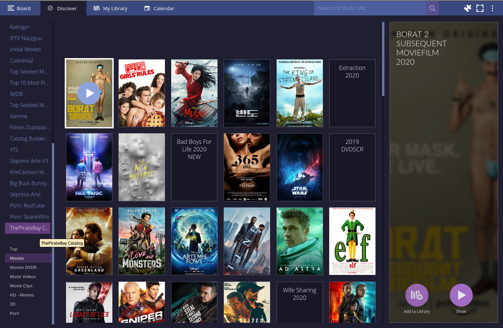

# ThePirateBay Catalog add-on for Stremio

### Show top movie or series torrents by category from ThePirateBay



## Quick Start

```bash
npm install
npm start
```

Then run Stremio, click the add-on button (puzzle piece icon) on the top right, and write `http://127.0.0.1:7000/manifest.json` in the "Addon Url" field on the top left.

**Pre-requisites: Node.js, Git**
