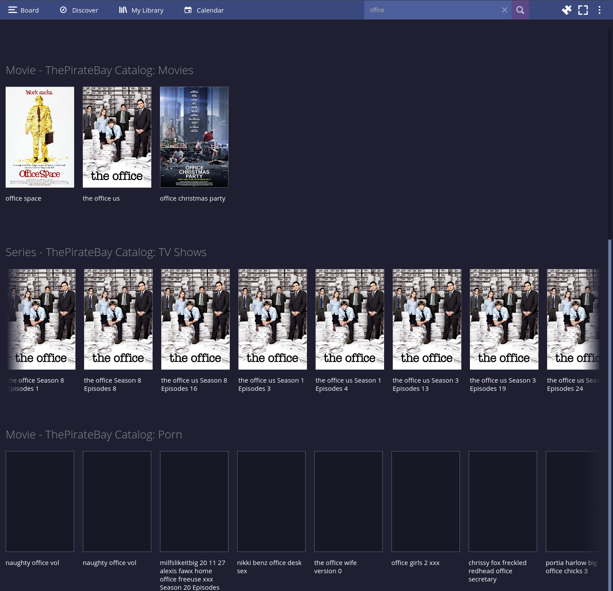

# ThePirateBay Catalog add-on for Stremio

### Show movies or series torrents by category from ThePirateBay


### Search movies or series torrents from ThePirateBay




## To run plugin locally

```bash
npm install
npm start
```

Then run Stremio, click the add-on button (puzzle piece icon) on the top right, and write `http://127.0.0.1:7000/manifest.json` in the "Addon Url" field on the top left.

Addon public url: https://5db836ec3ef8-thepiratebay-ctl.baby-beamup.club

publish once done: https://stremio.github.io/stremio-publish-addon/index.html


TOP 100 https://apibay.org/precompiled/data_top100_all.json

TOP 48 h https://apibay.org/precompiled/data_top100_48h.json

TOP movies 48 h https://apibay.org/precompiled/data_top100_48h_200.json

TOP recent https://apibay.org/precompiled/data_top100_recent.json